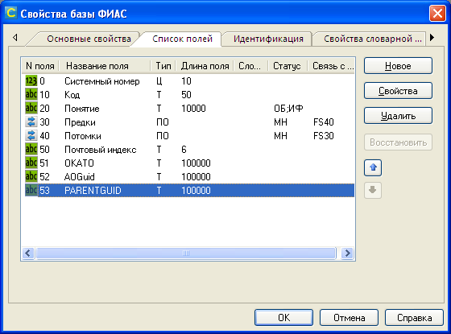

# Импорт данных ФИАС в иерархический словарь ИСУБД CronosPro

## Назначение
Импорт данных [ФИАС](https://fias.nalog.ru/Updates.aspx) в иерархический словарь для ИСУБД CronosPro. Источник - файлы `ADDROB??.dbf`, сохраненные в формат csv.  
     
## Описание   
Управляющая форма предназначена для слованого банка. Загружает данные в словарную базу с мнемокодм FS и строит иерархию, используя поля GUID и PARENTGUID исходной таблицы.   
В структуре словаря помимо стандартных полей (код, понятие, предки, потомки) должны присутствовать поля № 52 "AOGUID" и № 53 "PARENTGUID".
Код словаря формируется из значения поля PLAINCODE, понятие - из полей OFFNAME и SHORTNAME.

    
  
## Использование
1. Восстановить форму в словарный банк.  
2. При необходимости в модуле формы изменить мнемокод словарной базы.  
3. Запустить форму, выбрать загружаемый файл, требуемый уровень детализации словаря.
4. Нажать кнопку "Загрузить" и дождаться окончания работы.
