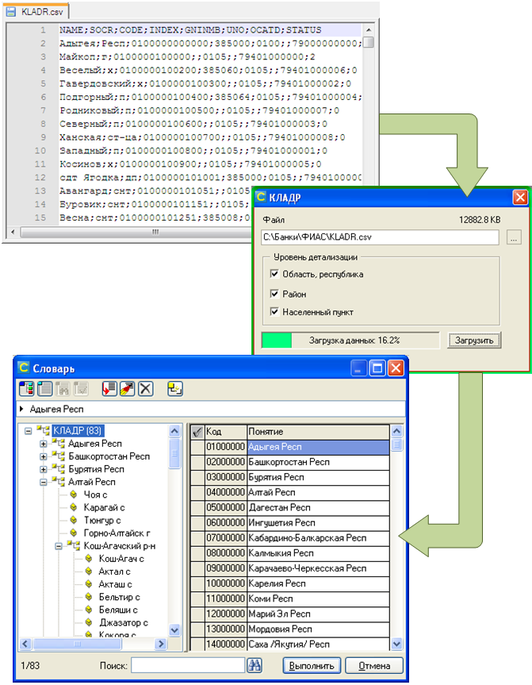
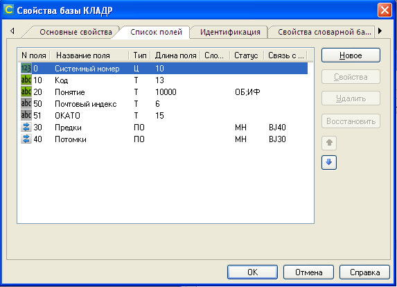

# Импорт КЛАДР 
## Назначение
Импорт данных [КЛАДР](https://fias.nalog.ru/Updates.aspx) в иерархический словарь для ИСУБД CronosPro. Источник - файл `KLADR.dbf`, сохраненный в формат csv.  
  
     
   
## Описание   
Управляющая форма предназначена для слованого банка. Загружает данные в словарную базу с мнемокодм BJ.   
**Перед загрузкой из словаря удаляются все ранее загруженные данные.**  
В структуре словаря помимо стандартных полей (код, понятие, предки, потомки) должны присутствовать поля № 50 "Почтовый индекс" и № 51 "ОКАТО".  
    

## Использование
1. Восстановить форму в словарный банк.  
2. При необходимости в модуле формы изменить мнемокод словарной базы.  
3. Запустить форму, выбрать загружаемый файл, требуемый уровень детализации словаря.
4. Нажать кнопку "Загрузить" и дождаться окончания работы.
